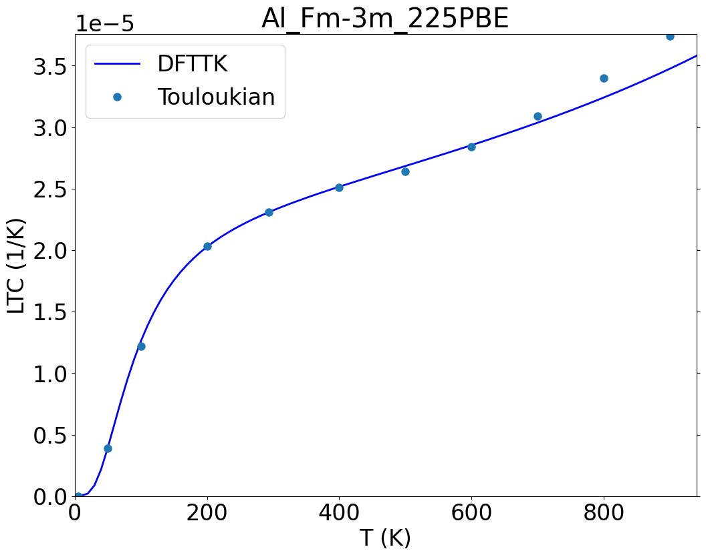
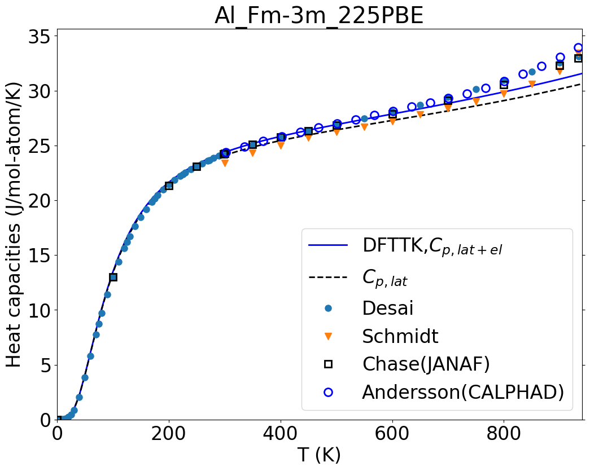

Examples
========

The examples are designed for users to test the DFTTK package, currently including 
i) the stoichiometric phases of Al, Ni, Al3Ni, AlNi, AlNi3, Al3Ni4, and Al3Ni5, and 
ii) the fcc solution phases of Al3Ni, AlNi, AlNi3 treated using SQS. 
The examples can be downloaded from a separate GitHub repository by 

.. code-block:: bash

git clone https://github.com/PhasesResearchLab/dfttk_example 

where

 - ``input/`` - contains input files for the exampled calculations
 - ``output/`` - contains the calculated results for the examples
 - ``ExptData.json`` - contains experimental data for comparison with the DFTTK calculations

Al example
----------

 - ``input/Al/`` - contains two files
    - ``POSCAR`` - the regular VASP POSCAR file
    - ``SETTINGS.yaml`` - the setting file for quasiharmonic phonon calculation
 - ``output/Al_Fm-3m_225PBE/`` - contains all calculated thermodynamic properties
    after post-processing the data stored in the MongoDB database for a finished
    DFT calculations
    - dir ``figures/`` - plots in png format for most of the thermodynamic properities
    - file ``readme`` - extensive summary of the calculated results in json format
    - file ``fvib_ele`` - tablated data containing the calculated thermodynamic properties
    - file ``fvib_eij`` - tablated data containing the calculated thermal expansion coefficient tensor
    - file ``record.json`` - SGTE fitting record for heat capacity, Gibbs energy, enthalpy, and entropy at given temperature range
 - ``ExptData.json`` - contains some experimental thermodynamic data for
    a collection of materials to verify the DFTTK calculations.

The following gives the steps to run the ``Al`` example

.. code-block:: bash

 cd Al
 dfttk run -wf robust -f POSCAR.Al -l -m 1

This will submit the batch DFT job to the system. One can check the progress
of the DFT calculations by ``lpad get_wflows``. Only when all the values for
the 'states_list' fields are shown as 'C' implies the DFT job done. Then One
can go to next step by run

.. code-block:: bash

 dfttk thfind -get -plot DFTTK -expt ExptData.json
 #note that the key ``0c1887fa-0cb4-4ce2-9559-7f7909ffa11a`` is obtained from the file ``input/METADATAS.yaml`` automatically produced by the VASP calculation step.

The above will produce more thatn 20 figures stored in the folder “Al_Fm-3m_225PBE/figures/” and they
can be viewed t by clicking them in Windows/IOS or using the linux command ``display`` to show the figure.
For example for linux

.. code-block:: bash

  display Al_Fm-3m_225PBE/figures/LTC.png #to see the linear thermal expansion coefficient

.. code-block:: bash

  display Al_Fm-3m_225PBE/figures/Heat_capacities.png #to see the heat capaticity, and so on

