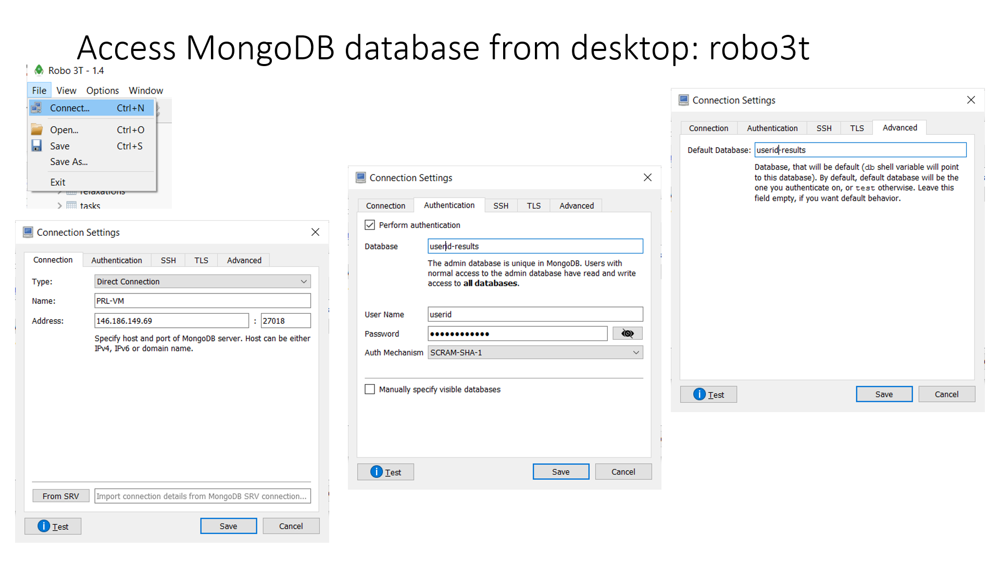

Installation
============

It is recommended to install DFTTK under the `anaconda <https://docs.anaconda.com/anaconda/install/>`_ environment. Under the linux command prompt (or anaconda powershell prompt for Windows), one can create a preferred directory and then run
#Note for Windows: 

1.	Open your anaconda powershell prompt and run as administrator.
2.	Go to the location where you want to install DFTTK. 

- Release version

.. code-block:: bash

    pip install dfttk

- Development version

.. code-block:: bash

    git clone https://github.com/PhasesResearchLab/dfttk.git
    cd dfttk
    pip install -e .

- Alpha interanal daily test version

.. code-block:: bash

    git clone https://github.com/yiwang62/dfttk.git
    cd dfttk
    pip install -e .

mkdir a folder named ``config`` whereever you want to followed by copy the file ``db.json``, ``my_launchpad.yaml`` from your MongoDB manager into ``config/``. See the section :ref:`Config MongoDB`

.. code-block:: bash

    dfttk config -all --nodes 1 --ppn 16 --pmem 32gb -aci -M yourcomputer -mapi PMG_MAPI_KEY

where

    | For the system other than aci, "-aci" should be replace by "-psp vasp_psp/" where vasp_psp is a place holding your vasp pseudopotentials
    | yourcomputer is your computer name, such as aci-vasp5, aci-vasp6, cori-knl, cori-ksw, bridges2, stampede2
    | yourbactch can be pbs, slurm
    | PMG_MAPI_KEY can be obtained by: Go to the materials project website, https://materialsproject.org/, under the API section, you will easily find you API Keys number.
    | finally, you need to change the account number and queue/partition number in the ``config/my_qadapter.yaml`` file

- Additional steps for installation in Windows

One need to add two environmental variables by right click Windows symbol located in the lower
left corner -> system -> (scrolling down to) Advanced system settings -> Environmental variales -> "New.." button

    | HOME - create a Windows environmental variale named 'HOME', something similiar to "C:\Users\xxxxx" where xxxxx is your login in user name
    | FW_CONFIG_FILE - create a Windows environmental variale named 'FW_CONFIG_FILE' pointed to the 'config' folder

Config MongoDB
--------------

DFTTK needs MongoDB to manage DFT calculations and outputs. The users of DFTTK can either buy the commercial MongoDB database service or set up their own MongoDB server.

Ask the MongoDB system manager for two json files: one named ``db.json`` and another named ``my_launchpad.yaml`` and save them in a ``config`` folder wherever you choose.

``db.json`` used by `FireWorks <https://materialsproject.github.io/fireworks/introduction.html>`_ through MongoDB to access the DFTTK output results, templated as follows.

.. _JSONLint: https://jsonlint.com

.. code-block:: JSON

    {
        "database": "userid-results",
        "collection": "tasks",
        "admin_user": "userid",
        "admin_password": "pass1",
        "readonly_user": "userid-ro",
        "readonly_password": "pass2",
        "host": "146.186.149.69",
        "port": 27018,
        "aliases": {}
    }

``my_launchpad.yaml`` used by `FireWorks <https://materialsproject.github.io/fireworks/introduction.html>`_ through MongoDB for DFT job managements, templated as follows.

.. code-block:: YAML

    host: 146.186.149.69
    name: userid-fws
    password: pass3
    port: 27018
    ssl_ca_file: null
    strm_lvl: INFO
    user_indices: []
    username: userid
    wf_user_indices: []

Access MongoDB database from desktop
------------------------------------

  One can install robo3T from https://robomongo.org/. One needs to use the information
  from the ``db.json`` file to setup robo3T connection as indicated below

#note

  1. ``PSU-VM`` is a label of your choice to remark the MongoDB connection;
  2. ``146.186.149.69`` is the ip address of the MongoDB server;
  3. One needs to replace ``userid`` with the one (i.e. the value field of ``admin_user``) from the ``db.json`` file together with the the value field of ``admin_password``

Job submission/run
------------------

Pymatgen task to MongoDB from Windows, MacOS, or Linux

.. code-block:: bash

    dfttk run –wf robust –f POSCAR –l

Submit DFT job only in Linux

.. code-block:: bash

    qlaunch singleshot; or
    qlaunch rapidfire

