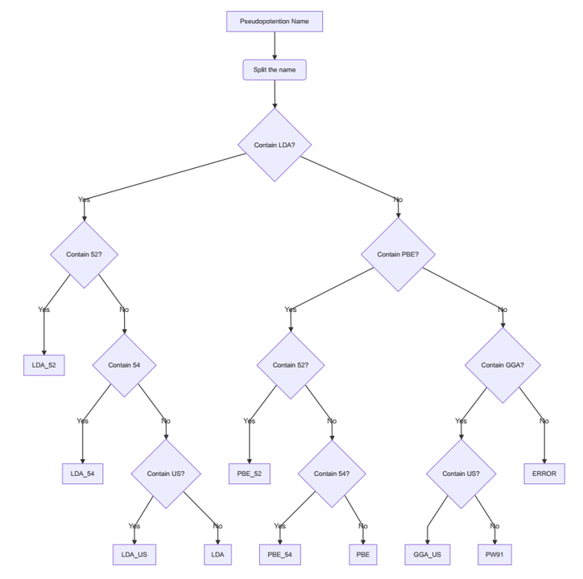

# Configuration of DFTTK

## Content

- [Preparation](#Preparation)
- [Configure all with one command](#Configure-all-with-one-command)
- [Configure separately](#Configure-separately)
  - [Configuration for atomate](#Configuration-for-atomate)
  - [Configuration for pymatgen](#Configuration-for-pymatgen)
- [Example](#Example)
- [Validation for configuration](#Validation-for-configuration)
- [Help for `dfttk config` command](#Help-for-dfttk-config-command)

---

## Preparation

For configure dfttk, the following file you need to prepare.

```bash
current_folder
 psp                          [specified by -psp]
  pseudopotential_content  [required if you didnot configurate pymatgen]
  ...
 config                       [specified by -c parameter]
  db.json                  [required]
  my_launchpad.yaml        [required]
  FW_config.yaml           [optional]
  my_fworker.yaml          [optional]
  my_qadapter.yaml         [optional]
 vaspjob.pbs                  [optional, specified by -q parameter]
```

After prepared the above **required** file, simply run `dfttk config -all` to finish the configuration. If such command successes, you can skip **all** of the reset part of this documents. If not, please reading the following parts.

- **pseudopotential_content:** The vasp pseudopotential.

  - **PRL Group Notes:** For PRL group, if you use ACI at PSU, you can skip this part,  using `-aci` parameter

  - It can be compressed file (`*.tar.gz`) or uncompressed folder. The name is handled as follows:

    

    **Note:** **1.**  The split can recognize`.`,`-`,`_`,`+`,`=`,`*` and `space` .

        **2.**  After split, the name will be a list. The condition e.g `contain 52` is the elements' level. It means `52` should be a elements of the list. But `US` is string level, which means `US` only need be a sub-string of the elements of the list. 

        **3.** For compressed file, it support `*.tar.gz` and `*.tar`

    	e.g. `potpaw_PBE`, `PBE.tar.gz` and `potpaw_PBE_5254` will be recognized as `PBE`.

    		    `potpaw_PBE.52` and `potpaw_PBE_52` will be recognized as `PBE_52`

    		    `potUSPP_LDA` and `POT_LDA_US` will be recognized as `LDA_US`

    After prepare, the file structure should look like as follows:

    <details>
        <summary>Click for details</summary>
        <pre><code>e.g. psp
          potpaw_LDA.54.tar.gz
          potpaw_PBE.54.tar.gz
          ...
     or: psp
          potpaw_LDA_54
           Ac
           ...
          potpaw_PBE_54
           Ac
           ...
          ...</code></pre>
    </details>

    The original pseudopotential file, please ask those who are in charge of vasp in your group.

- **MAPI_KEY:** The API key of [Materials Project](https://materialsproject.org), ref. [API KEY](https://materialsproject.org/open)

- **vaspjob.pbs:** The submitting script of your queue system. **Currently, only pbs system is supported**

- **other config files:** At least, you need prepare two files, `db.json` and `my_launchpad.yaml`. The template is shown in the `config` folder.

  - For more details, please ref. [Configure database connections and computing center parameters](https://atomate.org/installation.html#configure-fireworks)

- **PRL GROUP NOTES:**

  - For **db.json** and **my_launchpad.yaml** file, please ask **Brandon** for help.
  - **vaspjob.pbs** for ACI can be download from github
  - For **pseudopotential**, two choices: 1. using the pseudopotentials in ACI account (Using `-aci` parameter). 2. Download the pseudopotential from group's box(`Group Documents/VASP_potential` note: only `PBE_54` and `LDA_54`).

[TO TOP](#Content)

---

## Configure all with one command

- `dfttk config -all`

- For **ACI** at PSU user, please use `dfttk config -all -aci`

  ```shell
  usage: dfttk config [-h] [-all] [-p PATH_TO_STORE_CONFIG] [-a]
                      [-c CONFIG_FOLDER] [-q QUEUE_SCRIPT] [-qt QUEUE_TYPE]
                      [-v VASP_CMD_FLAG] [-mp] [-aci] [-psp VASP_PSP_DIR]
                      [-mapi MAPI_KEY] [-df DEFAULT_FUNCTIONAL]
  ```

  The meaning of the parameters, please ref [Help for `dfttk config` command](#Help-for-dfttk-config-command) or just run `dfttk config -h`

[TO TOP](#Content)

---

## Configure separately

### Configuration for atomate

- Config manual, ref [Configure database connections and computing center parameters](https://atomate.org/installation.html#configure-fireworks)

- `dfttk config -a`

  ```shell
  usage: dfttk config -a [-p PATH_TO_STORE_CONFIG] [-c CONFIG_FOLDER] [-q QUEUE_SCRIPT] 
                         [-qt QUEUE_TYPE] [-v VASP_CMD_FLAG] 
  ```

  The meaning of the parameters, please ref [Help for `dfttk config` command](#Help-for-dfttk-config-command) or just run `dfttk config -h`

[TO TOP](#Content)

---

### Configuration for pymatgen

- Config manual, ref [POTCAR setup in pymatgen](https://pymatgen.org/installation.html#potcar-setup)

- `dfttk config -mp`

  ```shell
  usage: dfttk config -mp [-aci] [-p PATH_TO_STORE_CONFIG] [-psp VASP_PSP_DIR] [-mapi MAPI_KEY] 
                      [-df DEFAULT_FUNCTIONAL]
  ```

  The meaning of the parameters, please ref [Help for `dfttk config` command](#Help-for-dfttk-config-command) or just run `dfttk config -h`

[TO TOP](#Content)

---

## Example

```shell
dfttk config -all -p test_config -mapi test_api
```

In `test_config` folder

```shell
test_config
 config
  db.json
  FW_config.yaml
  my_fworker.yaml
  my_launchpad.yaml
  my_qadapter.yaml
 logs
 vasp_psp
     POT_GGA_PAW_PBE_54
     Ac
      ...
     POT_LDA_PAW_54
        Ac
         ...
```

In `~/.bashrc`

```shell
export FW_CONFIG_FILE=/gpfs/scratch/mjl6505/test/dfttk/tutorial/config/test_config/config/FW_config.yaml
```

in `~/.pmgrc.yaml`

```yaml
PMG_DEFAULT_FUNCTIONAL: PBE
PMG_MAPI_KEY: test_api
PMG_VASP_PSP_DIR: /gpfs/scratch/mjl6505/test/dfttk/tutorial/config/test_config/vasp_psp
```

[TO TOP](#Content)

---

## Validation for configuration

- `dfttk config -t`

  This command will validate the configuration, and give some error or tips for the incorrect configuration

  ```shell
  dfttk config -t [{all,pymatgen,atomate,none}]
  ```

  - Currently only support validation for the configuration of pymatgen

[TO TOP](#Content)

---

## Help for `dfttk config` command

```shell
dfttk config -h
```

```shell
DFTTK version: 0.1+121.g8fddda3.dirty
Copyright  Phases Research Lab (https://www.phaseslab.com/)

usage: dfttk config [-h] [-all] [-p PATH_TO_STORE_CONFIG] [-a]
                    [-c CONFIG_FOLDER] [-q QUEUE_SCRIPT] [-qt QUEUE_TYPE]
                    [-v VASP_CMD_FLAG] [-mp] [-aci] [-psp VASP_PSP_DIR]
                    [-mapi MAPI_KEY]
                    [-df {LDA,LDA_52,LDA_54,LDA_US,PBE,PBE_52,PBE_54,PW91,PW91_US,Perdew-Zunger81}]
                    [-t [{all,pymatgen,atomate}]]

optional arguments:
  -h, --help            show this help message and exit
  -all, --all           Configure atomate and pymatgen.
  -p PATH_TO_STORE_CONFIG, --prefix PATH_TO_STORE_CONFIG
                        The folder to store the config files. Default: .
                        (current folder)
  -a, --atomate         Configure atomate.
  -c CONFIG_FOLDER, --config_folder CONFIG_FOLDER
                        The folder containing config files, at least contain
                        db.json and my_launchpad.yaml. Default: '.'
  -q QUEUE_SCRIPT, --queue_script QUEUE_SCRIPT
                        The filename of the script for sumitting vasp job. It
                        will search in current folder and sub-folders.
                        Default: vaspjob.pbs
  -qt QUEUE_TYPE, --queue_type QUEUE_TYPE
                        The type of queue system. Note, only pbs is supported
                        now. Default: pbs
  -v VASP_CMD_FLAG, --vasp_cmd_flg VASP_CMD_FLAG
                        The flag to distinguish vasp_cmd to othe commands in
                        queue_script. Default: vasp_std
  -mp, --pymatgen       Configure pymatgen.
  -aci, --aci           Using the pesudopotential on the ACI cluster at PSU.
  -psp VASP_PSP_DIR, --vasp_psp_dir VASP_PSP_DIR
                        The path of pseudopotentials. Default: psp
  -mapi MAPI_KEY, --mapi_key MAPI_KEY
                        The API key of Materials Projects
  -df {LDA,LDA_52,LDA_54,LDA_US,PBE,PBE_52,PBE_54,PW91,PW91_US,Perdew-Zunger81}, --default_functional {LDA,LDA_52,LDA_54,LDA_US,PBE,PBE_52,PBE_54,PW91,PW91_US,Perdew-Zunger81}
                        The default functional. Default: PBE
  -t [{all,pymatgen,atomate}], --test_config [{all,pymatgen,atomate}]
                        Test for configurations. Note: currently only support
                        for pymatgen.
```

