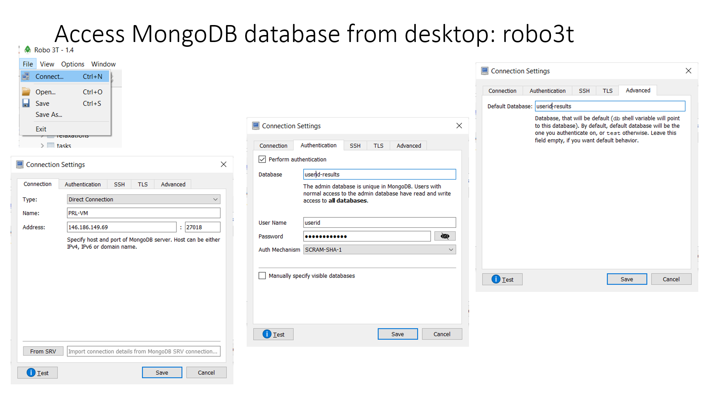

Installation
============

It is recommended to install DFTTK under the `anaconda <https://docs.anaconda.com/anaconda/install/>`_ environment. Under the linux command prompt (or anaconda powershell prompt for Windows), one can create a preferred directory and then run

- Release version

.. code-block:: bash

    pip install dfttk

- Development version

.. code-block:: bash

    git clone https://github.com/PhasesResearchLab/dfttk.git
    cd dfttk
    pip install -e .

- Alpha interanal daily test version

.. code-block:: bash

    git clone https://github.com/yiwang62/dfttk.git
    cd dfttk
    pip install -e .

mkdir a folder named ``config`` whereever you want to followed by copy the file ``db.json``, ``my_launchpad.yaml`` from your MongoDB manager into ``config/``. See the section :ref:`Config MongoDB`

.. code-block:: bash

    dfttk config -all --nodes 1 --ppn 16 --pmem 32gb -aci -M yourcomputer -qt yourbatch -mapi PMG_MAPI_KEY

where

    | vasp_psp is a place holding your vasp pseudopotentials    
    | yourcomputer is your computer name, such as aci-rour, cori-knl, cori-ksw, bridges2, stampede2
    | yourbactch can be pbs, slurm
    | PMG_MAPI_KEY can be obtained by: Go to the materials project website, https://materialsproject.org/, under the API section, you will easily find you API Keys number.
    | finally, you need to change the account number and queue/partition number in the ``config/my_qadapter.yaml`` file

Config MongoDB
--------------

DFTTK needs MongoDB to manage DFT calculations and outputs. The users of DFTTK can either buy the commercial MongoDB database service or set up their own MongoDB server. 

Ask the MongoDB system manager for two json files: one named ``db.json`` and another named ``my_launchpad.yaml`` and save them in a ``config`` folder wherever you choose.

``db.json`` used by `FireWorks <https://materialsproject.github.io/fireworks/introduction.html>`_ through MongoDB to access the DFTTK output results, templated as follows. 

.. _JSONLint: https://jsonlint.com

.. code-block:: JSON

    {
        "database": "userid-results",
        "collection": "tasks",
        "admin_user": "userid",
        "admin_password": "pass1",
        "readonly_user": "userid-ro",
        "readonly_password": "pass2",
        "host": "146.186.149.69",
        "port": 27018,
        "aliases": {}
    }

``my_launchpad.yaml`` used by `FireWorks <https://materialsproject.github.io/fireworks/introduction.html>`_ through MongoDB for DFT job managements, templated as follows. 

.. code-block:: YAML

    host: 146.186.149.69
    name: userid-fws
    password: pass3
    port: 27018
    ssl_ca_file: null
    strm_lvl: INFO
    user_indices: []
    username: userid
    wf_user_indices: []

Access MongoDB database from desktop
------------------------------------

  One can install robo3T from https://robomongo.org/. One needs to use the information
  from the ``db.json`` file to setup robo3T connection as indicated below

#note

  1. ``PSU-VM`` is a label of your choice to remark the MongoDB connection;
  2. ``146.186.149.69`` is the ip address of the MongoDB server;
  3. One needs to replace ``userid`` with the one (i.e. the value field of ``admin_user``) from the ``db.json`` file together with the the value field of ``admin_password``

YPHON
-----

To postprocess the finite properties, the Yphon package is required. Yphon can be installed by run

.. code-block:: bash

    cd ~
    git clone https://github.com/yiwang62/YphonPackage
    #Note: Usually the precompiled binaries should be executable in the common Linux/Unix environment. If not, do the following:

.. code-block:: bash

    cd YphonPackage/YPHON/YPHON 
    make
    #Note: If errors reported in the compiling stage, insert one line #define R_OK 1 after #include

For csh user: the command search path should be changed by inserting line below into the .cshrc  (.tcshrc) file

.. code-block:: bash

    set path = (. ~/YphonPackage/YPHON/YPHON $BIN_PATH $path)

For bsh user: the command search path should be changed by inserting the lines below into the .bash_profile (.bashrc) file

.. code-block:: bash

    PATH=.:~/YphonPackage/YPHON/YPHON:$BIN_PATH:$PATH
    export PATH

