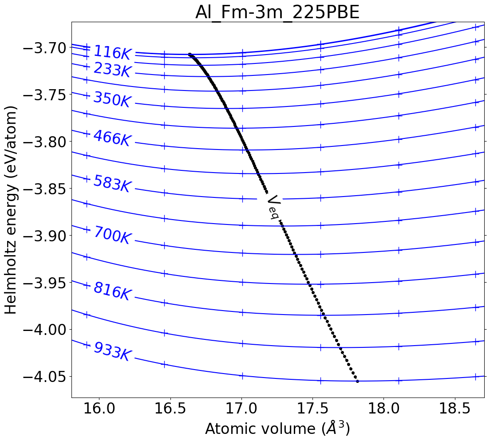

Quick guide to run DFTTK
========================

Submit dfttk DFT batch job
--------------------------

The DFT calculations are managed by the run modules by the command ``dfttk run``

- Submit a single calculation

Go to any folder under ytests folder say ``cd dfttk/ytests/ex55``, then run

.. code-block:: bash

    dfttk run -f POSCAR.Al -l -m 1

Postprocess DFTTK results
-------------------------

To postprocess the DFTTK results and get thermodynamic properties.

- Single postprocess

.. code-block:: bash

    dfttk thelec -renew -plot find_or_DFT -metatag metatag.   

where metatag is the metadata tag automatically produced after one submits the dfttk job, the argument ``-renew`` instruct thelec to redo the calculations even already done previously, and the arguments ``-plot find_or_DFT`` instruct thelec to find the label for theoretical curve from the MongoDB database (in the above case, it found ``PBE``) and use ``DFT`` if not found. In the above example, one can find out ``metatag`` in the value field of ``tag`` by ``cat dfttk/ytests/ex55/METADATA.yaml``

The run of the above command will cost a couple of minutes. After the command done, one will see a folder with name like ``compound_xxx-xxx`` (in the above example, the folder name will be ``Al_Fm-3m_225PBE`` within which the fcontents are:

folder ``figures`` - plots in png format for most of the thermodynamic properties;

file ``readme`` - contain key information in json format;

file ``fvib_ele`` - text table contains the thermodynamic properties

file ``record.json`` - json file contains Shomate Equation (SGTE) fitting of Cp, G-H298.15, H-H298.15, and S; and

folder ``Yphon`` - extracted data to run Yphon for further analysis

The figures stored in the figures folder can viewed by the command ``display``, e.x, to see the evolution of Helmholtz energy as functions of volume and temperature

.. code-block:: bash

    display Al_Fm-3m_225PBE/figures/Helmholtz_energy.png 

